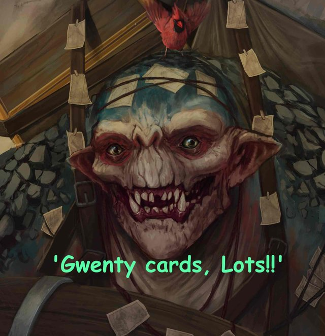

# Gwent Card Parser



**오우썸**한 카드 파서

Parse Gwent Data Definiton files to JSON

**this project is Not Finished Yet**

## How To Use

1. Go To Path/to/Gwent/Folder/GWENT_Data/StreamingAssets
2. Copy 'data_definintions' to this project directory
3. rename 'data_definitons.zip' (it's actually zip file)
4. unzip folder in this directory
5. `npm install`
6. `npm ./parser [locale]`
7. output file is `GwentDefinitions.json`

## Available Locale Argments

this project can be parsed to JSON with all laguage available in GWENT

### locales

- `de-de`
- `en-us`
- `es-es`
- `ex-mx`
- `fr-fr`
- `it-it`
- `ja-jp`
- `ko-kr`
- `pl-pl`
- `pt-br`
- `ru-ru`
- `zh-cn`
- `zh-tw`

## Output

**this project is Not Finished Yet**

currently GwentDefinitons.json has format below.

```
{
  "Factions": {
    [FactionId]: { "fluff", "name" }
  },
  "Cards": {
    [CardId]: {
      "fluff", "name", "tooltip", "Power", "Armor", "FactionId", "Rarity", "Provision", "Type", "Kind"
    }
  },
  "Keywords": {
    [KeywordName]: [KeywordDescription]
  }
}
```
